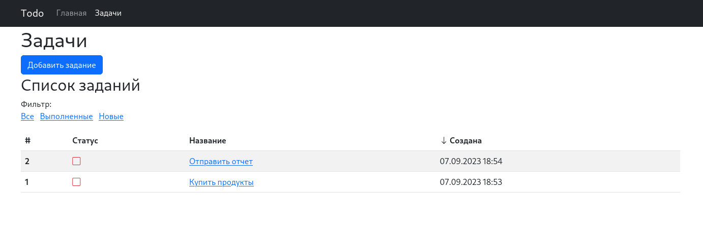
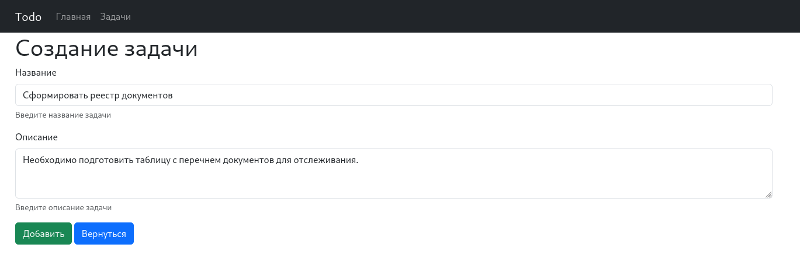
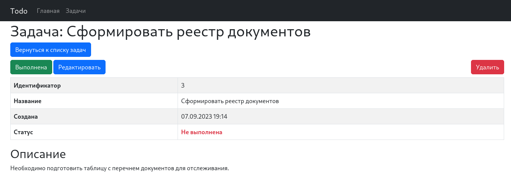
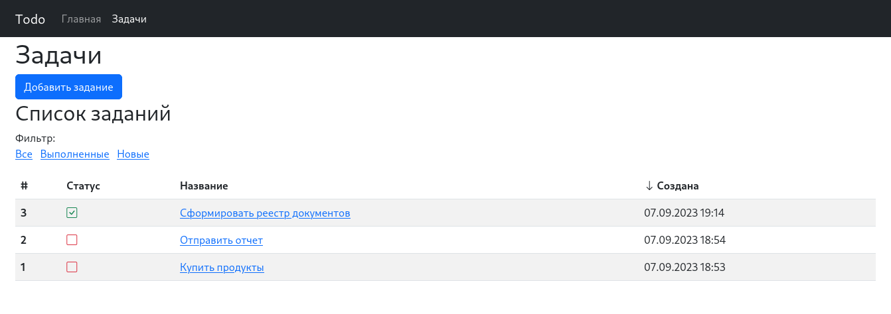

# job4j_todo

[](https://github.com/evgnovoselov/job4j_todo/actions/workflows/maven.yml)
[](https://codecov.io/gh/evgnovoselov/job4j_todo)

## Описание проекта

Данный проект представляет веб-сервис по работе с задачами, выставление задачи 
и ее завершении. Проект адаптирован так же на мобильные устройства 
с помощью сетки и блоков **Bootstrap**.

Используя **Docker Compose** или **Podman Compose**, можно легко 
запустить проект и посмотреть его работоспособность.

Проект использует **Hibernate** для работы с базой данных и слоистую структуру
разбитую по пакетам. Так же проект имеет большой процент покрытия тестами,
что облегчает добавление нового функционала или изменение прежнего.
За генерацию ответов на запросы браузера используется 
серверный шаблонизатор **Thymeleaf**.

## Стек технологий

При разработке и тестировании использовались следующие технологии:

* Java 17
* Spring Boot 3.1.3
* Liquibase 4.20.0
* Hibernate ORM 6.2.7
* PostgreSQL JDBC Driver 42.6.0
* H2database 2.1.214
* Thymeleaf 3.1.1
* WebJars 0.52 (Для добавления библиотек: Bootstrap 5.3.1 и Bootstrap Icons 1.10.5)
* Checkstyle 3.3.0
* JaCoCo 0.8.10
* JUnit 5.9.3
* Mockito 5.3.1
* AssertJ 3.24.2
* Docker Compose 1.25.0 (Образы PostgreSQL 15 и Adminer 4)

За место Docker Compose можно использовать Podman и Podman Compose.

## Требования к окружению

Для запуска проекта необходимо следующее программное обеспечение:

* Java 17
* Maven 3.9.3
* PostgreSQL 15 или Docker Compose 1.25.0

За место Docker Compose можно использовать Podman и Podman Compose.

## Запуск проекта

Следующие этапы помогут запустить тест проекта и сам сервис задач.

### Запуск тестов проекта

Для тестов используется база данных **H2database**, которая настроена хранить данные в файле,
поэтому создается два вспомогательных файла для работы тестов `testdb.mv.db` и `testdb.trace.db`.

Для запуска теста нужно выполнить следующие команды:

Запустим тесты:

```text
mvn test
```

Данная команда запустит миграции бд, тестирование проекта и будет показан его результат.

Если произошла ошибка с базой данных, попробуйте сначала произвести миграцию в ручную
с помощью **Liquibase**, **H2database** создаст 2 файла `testdb.mv.db` и `testdb.trace.db`,
с помощью команды:

```text
mvn liquibase:update --activate-profiles test
```

### Запуск приложения

Для пробного запуска проекта можно воспользоваться базой данных, которая работает через
**Docker Compose** настройки которого находятся в файле `docker-compose.yml`.

Ниже будут представлены команды и их пояснение для выполнения:

Сначала запустим базу данных через **Docker Compose**:

```text
docker-compose up
```

Появится информация о запуске базы данных и будет доступен **Adminer**
по адресу: http://localhost:8081/. Входить в базу данных **_необязательно_**,
но для входа можно указать следующие данные:

```text
Драйвер PostgreSQL
Сервер: db
Пользователь: postgres
Пароль: password
База данных: todo
```

После запуска контейнера будет чистая база данных, чтобы ее заполнить нужно выполнить следующую команду:

```text
mvn liquibase:update --activate-profiles production
```

После этой команды **Liquibase** применит миграции.

Затем мы запускаем приложение с помощью команды:

```text
mvn spring-boot:run
```

После того как в терминале появится информация об успешном запуске приложения, можно в браузере перейти
по адресу: http://localhost:8080/.

Для остановки сервиса **Задач** и **Docker Compose** необходимо в окне терминала,
запущенного приложения и **Docker Compose**, нажать сочетания клавиш: `Ctrl + C`.

## Взаимодействие с приложением

После запуска приложения, будет развернут локальный http-сервер **Apache Tomcat**
по адресу http://localhost:8080/.

Если перейти по данному адресу нас встретит главная страница приложения.



Страница задач, позволяет добавить новую задачу, фильтровать имеющиеся, а так же открывать
подробное описание задач.

Нажмем кнопку "Добавить задание" и нас встретит форма добавления задания.



После того как заполним форму и нажмем кнопку "Добавить", браузер откроет страницу задачи.



На странице задачи мы можем вернуться к списку задач, отметить выполненной задачу, отредактировать
и удалить задачу.

Отметим выполненной задачу и вернемся к списку задач.



Мы увидим, что статус задачи изменен и можем воспользоваться фильтрами для поиска новых задач или
удаления выполненных.

Спасибо, что ознакомились с описанием сервиса! По вопросам можете обратиться по контактам ниже.

## Контакты

Открыт для вопросов и предложений. Связаться со мной можно по ссылке ниже.

**Автор**: Евгений Новоселов

Сайт: https://enovoselov.com

Телеграмм: https://t.me/enovoselov
